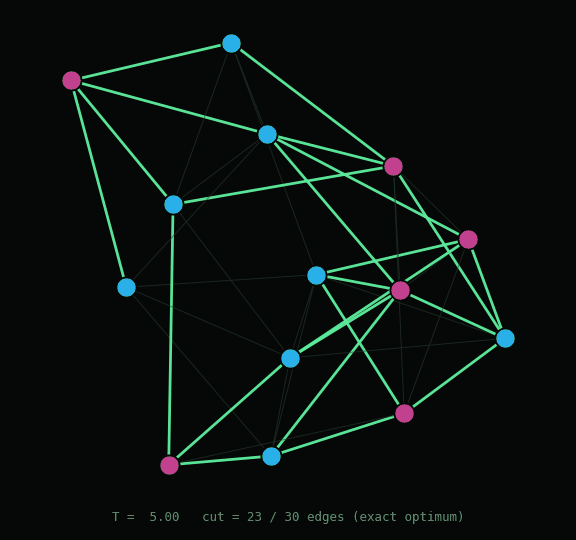
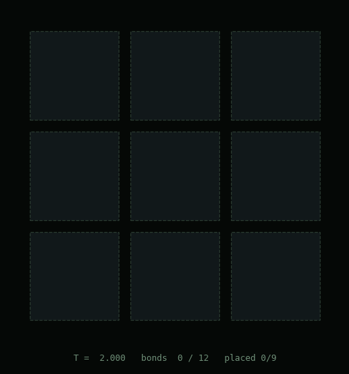
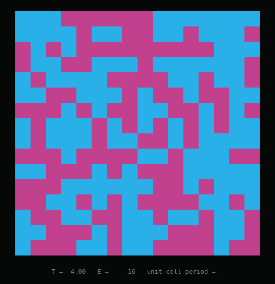
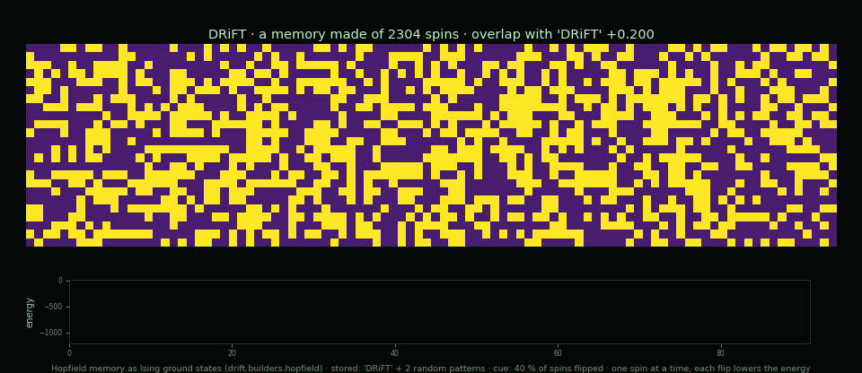

# DRiFT

> *A microscope for physical computation.*

**Place in the ecosystem.** DRiFT is the engine of computronium, and the Ising oracle every
other solver is checked against: OSCILLON, TRELLIS, QuBLAR's annealer. Its states cross to
Blaze (MPS), and its CUDA kernel is a LYTH candidate. See
[ADR-0005](docs/ADR-0005-computronium-engine.md).

DRIFT is a sandbox for **understanding how matter computes by minimizing energy**. It is
not built to prove a thesis or beat a benchmark — it is built to let you *see and measure*
one deep idea: that optimization, self-assembly, self-replication, and neural memory are
**the same mathematical object** — ground states of an Ising model — read with tensor
networks.

The name: a system *drifts* toward its energy minimum. The word is honest across all three
domains this project lives in — **physics** (drift to equilibrium / the ground state),
**neuroscience** (the drift-diffusion model of decision-making), and **replication**
(genetic drift).

## The thesis (one object, four faces)

A system of spins relaxing to its lowest-energy state **is a physical computer** solving an
optimization problem. Change only *what the Hamiltonian encodes*, and the same engine
becomes four different things:

| Face | The Hamiltonian encodes… | The ground state **is**… | The science |
|------|--------------------------|--------------------------|-------------|
| **Optimization** | an arbitrary QUBO/Ising problem | the optimal solution | combinatorial optimization, quantum annealing |
| **Self-assembly** | tile affinity rules (aTAM) | the assembled structure | molecular nanotech, DNA origami (Winfree) |
| **Self-replication** | couplings favoring periodicity | the replicated pattern | crystallization, von Neumann replicators |
| **Neural memory** | stored patterns (Hebbian) | a recalled memory (attractor) | Hopfield networks (Nobel Physics 2024) |

The brain, the crystal, the nanobot, the optimizer: **all compute by minimizing energy.**
DRIFT makes that visible and measurable under one roof.

## What DRIFT measures (the instrumentation)

Because the goal is *understanding*, the engine is built around observability. For every
face, the same probes:

- **How much it computes** → the **bond dimension χ** a tensor network needs to represent
  the state. χ is entanglement is information density — our thermometer for "how much
  computation lives in this matter" (the lesson learned in [Blaze](../Blaze)).
- **How it processes** → the **relaxation trajectory**: the path the system takes down the
  energy landscape.
- **What emerges** → the **ground state**: solution / structure / pattern / memory.
- **The physical floor** → the **Landauer cost** of the computation, and where real hardware
  sits relative to the ultimate limits (Margolus-Levitin, Lloyd).

## Honesty contract

The mathematics here — Ising ↔ QUBO ↔ Hopfield ↔ tensor networks ↔ optimization — is
**solid and established**. What is speculative is the leap to *"this is consciousness /
real grey goo / imminent nanobots."* DRIFT lives in the solid part and lets you *touch and
measure* the concepts that science fiction exaggerates, **without swallowing the
exaggeration**. Every claim in `docs/` is tagged as established science or as speculation.
See [`docs/CONCEPTS.md`](docs/CONCEPTS.md).

## Structure

```
DRIFT/
├── pyproject.toml                 pip install -e ".[dev]"
├── README.md
├── docs/
│   ├── TECH-REPORT.md             lab note / preprint skeleton (microscope)
│   ├── ADR-0001-architecture.md   architecture decision (engine + builders, Python-first)
│   ├── ROADMAP.md                 phases, each with an "understanding goal" + deliverable
│   ├── CONCEPTS.md                rigorous glossary, science vs. speculation tagged
│   └── results/                   PHASE{N}-results.md + SCALE-sweep.md
├── drift/                         Python core (engine, solvers, builders, metrics, viz)
│   └── benchmarks/                versioned instance bank (manifest + seeded families)
├── experiments/                   one script per phase + scale_sweep.py
├── tests/                         CPU pytest suite (GPU binary is local, not CI)
└── figures/
```

## Status

**Phases P0–P14 landed.** The engine, the four ground-state faces, the synthesis,
the *dynamical* face, the optimization face run *quantum*, the honest quantum-vs-classical
comparison, arithmetic as a ground state, universal computation, the tensor-network solver
that reads a ground state the way the thesis always promised, and the GPU parallel-tempering
engine that scales the optimization face past the exact wall:

- P0 — scaffolding · P1 — engine + observability · P2 — optimization (MaxCut) ·
  P3 — quantum ground state + χ thermometer · P4 — Hopfield memory · P5 — Wang-tile
  self-assembly · P6 — crystallization (self-replication) · P7 — the microscope.
- **P8 — the dynamical (reservoir) face** (`drift/reservoir.py`): the Ising
  substrate driven in time as a physical reservoir, with *measurable* compute
  capacity — Jaeger **memory capacity** and a **separation** metric (MC = 43.5 / N=200,
  peaking at spectral radius ρ ≈ 1.0, the edge of chaos — see
  `figures/phase8_reservoir.png`). It can be built from a real `drift.ising.IsingModel`,
  and its spectral radius is set via the **Spectra** spine, so DRIFT is a Spectra
  consumer. Ships with DRIFT's first automated test suite (`tests/test_reservoir.py`, 5/5).
- **P9 — the optimization face, run quantum** (`drift/anneal.py`): the *same* Ising
  ground state Phase 2 reached by thermal annealing, now reached by **adiabatic quantum
  annealing** — evolve the uniform superposition |+…+⟩ under `H(s) = (1−s)(−ΣXᵢ) + s·H_problem`.
  Slow anneal → ground state (success ≈ 1.00); sudden quench fails (success < 0.01). The
  honest limit, measured: shrinking the gap (`Δ_min` 0.96 → 0.27) drops success (0.99 → 0.60
  at fixed T) — **quantum annealing pays the spectral gap; when it closes, QA fails too. No
  magic** (`tests/test_anneal.py`, 5/5; `figures/phase9_quantum_anneal.png`).
- **P10 — quantum vs simulated annealing, honestly** (`drift/tunneling.py`): both annealers on
  the *same* landscape. On a thin Hamming-weight **spike**, single-spin-flip SA is **walled out
  (success 0.17)** while quantum annealing **tunnels it (0.45 at T=40, a ~2.6× edge)** — but on
  a plain funnel both win (≈1.0), and a taller spike costs QA too. **The quantum edge is
  specific (a thin tunnelable barrier), not general** (`tests/test_tunneling.py`, 4/4;
  `figures/phase10_tunneling.png`).
- **P11 — factoring as a ground state** (`drift/factoring.py`): the boldest "matter computes"
  demo — encode `p·q = N` as a QUBO whose **ground state reveals the factors** (the energy
  minimum *is* the arithmetic). Routed through `drift.solve`: small N is certified-exact;
  larger N is GPU-PT then CPU-PT with `certified=False`. DRIFT factors `15, 35, 143, … 221 =
  13×17` exactly (energy 0). A principle, measured, **not an attack** (`tests/test_factoring.py`;
  `figures/phase11_factoring.png`).
- **P12 — universal computation** (`drift/circuits.py`): logic gates synthesised as QUBO
  penalties and **composed by sharing wires**, so any Boolean circuit is a ground state.
  `Circuit.evaluate` goes through `drift.solve` (certified-exact on a 1-bit full adder; heuristic
  past that). AND/OR/NOT are complete → genuine universality (`tests/test_circuits.py`;
  `figures/phase12_universal.png`).
- **P13 — the tensor-network ground state** (`drift/mps.py`): the microscope's lens becomes the
  engine. An **MPS solver** finds the ground state by imaginary-time TEBD, so the bond dimension
  χ that was Phase 3's *thermometer* is now the solver's own *compute budget* — the truncation
  **is** the physics. Matches exact Lanczos to **5.8e-5**, is a variational upper bound,
  **reproduces Phase 3's χ peak independently** (Γ≈0.77, χ=6), and runs **past the exact wall**:
  n=48 (2⁴⁸≈2.8×10¹⁴ states) with E/n → −4/π. The "read with tensor networks" thesis, finally
  delivered (`tests/test_mps.py`, 7/7; `figures/phase13_tensor.png`).
- **P14 — the GPU Ising engine** (`cuda/ising_pt.cu`, `drift/gpu.py`) — *CPU reference + GPU engine
  landed and measured (RTX 5060 Ti, sm_120).* Scales the **optimization face** past the ~22-spin
  exact wall by **parallel tempering** (replica-exchange Metropolis). The CPU reference
  (`drift/solvers/parallel_tempering.py`) finds the **exact** ground energy on MaxCut, a ±J spin
  glass, and a ferromagnet (`tests/test_parallel_tempering.py`, 5/5). The CUDA engine reproduces
  those exact energies on-device (−22 / −33), then was measured through sparse-J, occupancy,
  checkerboard, warp-per-replica, and shared-memory staging: **~0.044 → ~1.29 Gflips/s @ n=2048
  (~29×)**, scaling to n=8192. Where an optimum is knowable at scale (bipartite MaxCut), the cut
  ratio is **1.0000** through n=1024. On arbitrary frustrated instances at scale, minima are
  **strong-not-certified** — stated plainly. The binary is a local Windows/sm_120 artifact and is
  **not in CI** (`docs/ADR-0004`, `docs/results/PHASE14-results.md`).

The two synthesis figures sit in `figures/phase7_four_faces.png` (one engine, four faces)
and `figures/phase7_roofline.png` (real systems vs. the Landauer floor). See
[`docs/TECH-REPORT.md`](docs/TECH-REPORT.md) (lab note),
[`docs/ROADMAP.md`](docs/ROADMAP.md), and `docs/results/PHASE{1..14}-results.md`.

## Results: one engine, four faces

Each film is one Ising model relaxing: simulated annealing (Metropolis, geometric cooling) or,
for memory, zero-temperature recall. Only the couplings (J, h) change from face to face.
Every frame is the state of the spins, and the final frame is where the dynamics actually
ended, not the best state seen along the way
([`experiments/cinema_faces.py`](experiments/cinema_faces.py),
[`experiments/cinema_recall.py`](experiments/cinema_recall.py)).

**Optimization: MaxCut.** 14 spins, one per node of a random graph; a spin's sign is its side
of the cut, and a cut edge (green) lowers the energy. Annealed from T = 5, the final state cuts
**30 edges, the exact optimum**, checked against all 2¹⁴ configurations.



**Self-assembly: Wang tiles.** A 3×3 jigsaw with one-hot tile variables (81 spins). Every
internal edge has its own glue colour, so the only tiling that satisfies all 12 bonds is the
intended picture, a cross. Tiles drop in, fall out, and lock once their glues match; the final
state has **12/12 bonds**. One caveat stays on the record: with the schedule of the original
four-faces figure (T 5 → 0.005), the final state was the picture in **0 of 40** seeds. That
figure shows the best state seen. Starting colder (T 2 → 0.05), it freezes into the picture
in 3 of 12 seeds, and this film is one of them.



**Self-replication: the crystal.** 256 spins on a 16×16 lattice, ferromagnetic nearest
neighbours and antiferromagnetic next-nearest along x (frustration). The ground state is a
unit cell, ↑↑↓↓, copied across the lattice; the final state has **period 4, E = −512**.



**Memory: Hopfield recall.** 2304 spins store the word as a ground state (Hebbian couplings),
next to two random patterns. The cue has 40 % of its spins flipped, and asynchronous updates
recall it one spin at a time: overlap **0.200 → 1.000**, energy −46 → −1152, falling at every
step. Storing three words instead fell into a *spurious mixture* (overlap 0.848), the classic
Hopfield failure, measured and kept.



**Universal computation.** Logic gates composed into a 1-bit full adder; the ground-state
engine computes its whole truth table. Any Boolean function is a ground state, bounded by the
same wall:


### Benchmark: real systems against the Landauer floor

Energy per operation, log scale. Real hardware sits **six orders of magnitude above the
Landauer limit**, and that gap is the headroom unconventional substrates compete for:


The other faces (the reservoir at the edge of chaos, quantum annealing and the spectral gap,
tunnelling, factoring as a ground state) and the scale sweep have their figures and write-ups in
[`docs/results/`](docs/results/) and [`docs/TECH-REPORT.md`](docs/TECH-REPORT.md).

## Install

```bash
pip install -e ".[dev]"
pytest tests/ -q
```

Python 3.10+ (CI runs 3.11). That editable install makes `import drift` work without
`PYTHONPATH`; experiment scripts still run from the repo root as before
(`python experiments/phase1_ferromagnet.py`). Tests are **CPU-only**. The CUDA engine
(`cuda/ising_pt.cu`, compiled with `nvcc -arch=sm_120`) is a local Windows/Blackwell binary
and is **not** built, committed, or run in CI — pytest skips any GPU test if the binary is
missing.

Runtime deps also live in `requirements.txt` (same pins as `pyproject.toml`) for scripts
that still install from the file.

## Solver path

Faces share **one** ground-state search: [`drift.solve`](drift/solve.py). Small instances
use the exact engine and come back `certified=True`. Larger ones fall through to GPU
parallel tempering when the CUDA binary is present, otherwise CPU-PT, and are marked
`certified=False` — a strong heuristic minimum, never a pretend optimum.
`factor()`, `Circuit.evaluate`, and `minimise_qubo` all go through this path. Pass
`require_certified=True` when a proven ground state is required (truth tables, uniqueness
claims); that restores the exact-engine wall instead of guessing.

**Scale sweep** (wall time, energy error, method vs n on a versioned instance bank).
`--ci` stays small (n≤10, no MPS, does not overwrite published CSV/JSON). The
published ladder is even n through 40 plus extra seeds on ER / ±J / bipartite at
cheap n:

```bash
python -m experiments.scale_sweep --ci                         # n≤10 smoke
python -m experiments.scale_sweep --profile local --write-report  # CPU n≤40
python -m experiments.scale_sweep --profile gpu  --write-report  # gpu-pt iff cuda/ising_pt exists
python -m drift.benchmarks                                     # rebuild manifest after catalog edits
```

See [`docs/results/SCALE-sweep.md`](docs/results/SCALE-sweep.md) and `figures/scale/scale_sweep.png`.
The scientific question and the v1 catalog live in `drift/benchmarks/instances/manifest.json`.
A CPU-only machine records **cpu-pt**, not gpu-pt — the JSON field `gpu_pt_rows` says so.

## Stack

Python-first (NumPy/SciPy + matplotlib for the engine and visuals — fast to iterate and
*see*). The hot-path **optimization** solver is the Phase-14 CUDA parallel-tempering engine
(local Windows/sm_120 binary — not in CI). Higher-D / large-χ **tensor-network** GPU/Rust
work is still later; DRIFT is a microscope, not a SOTA race.
