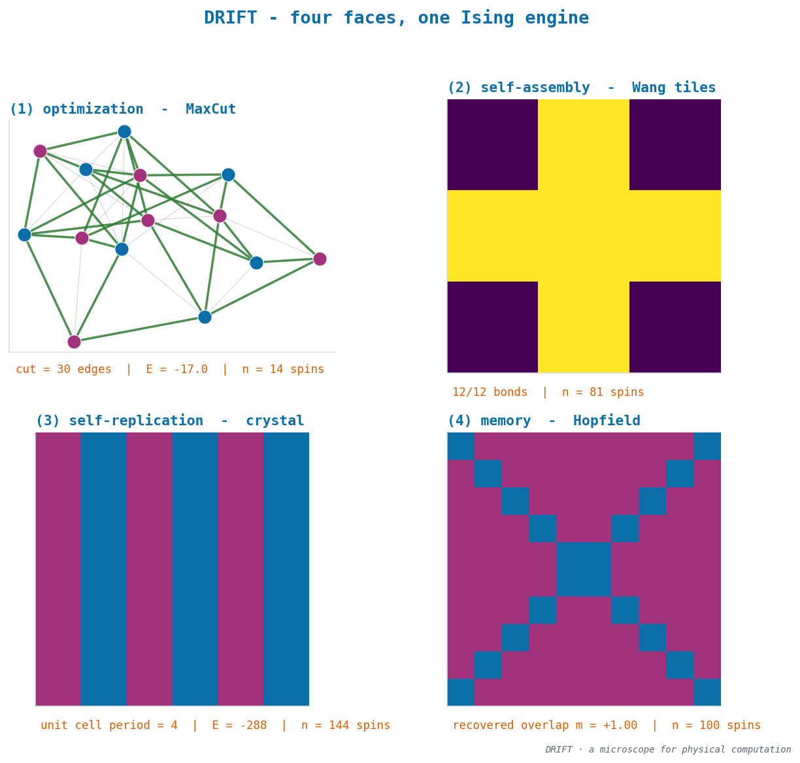
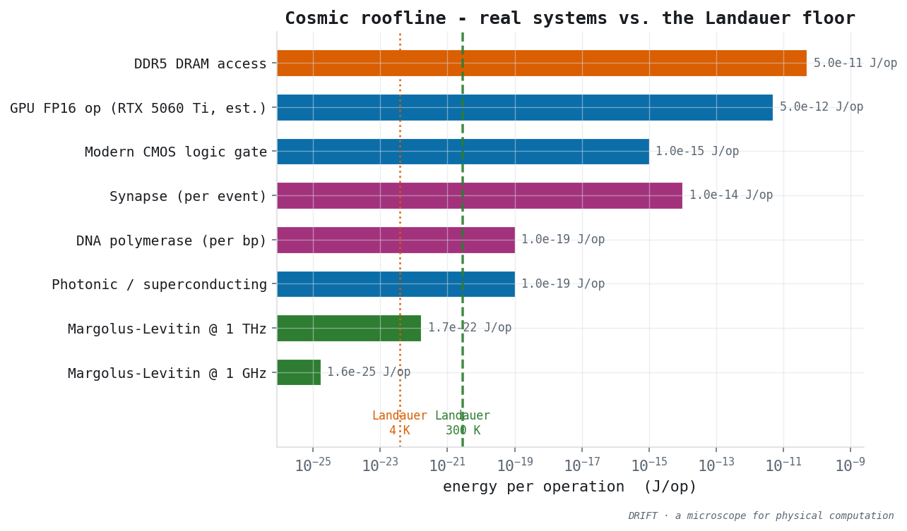
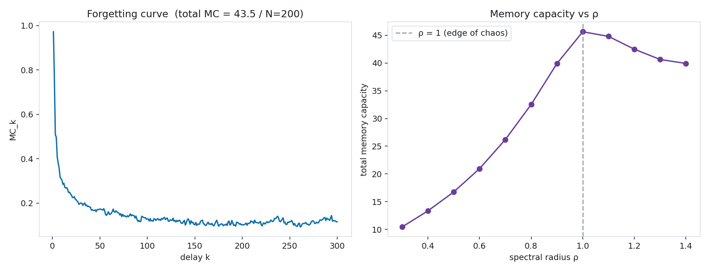
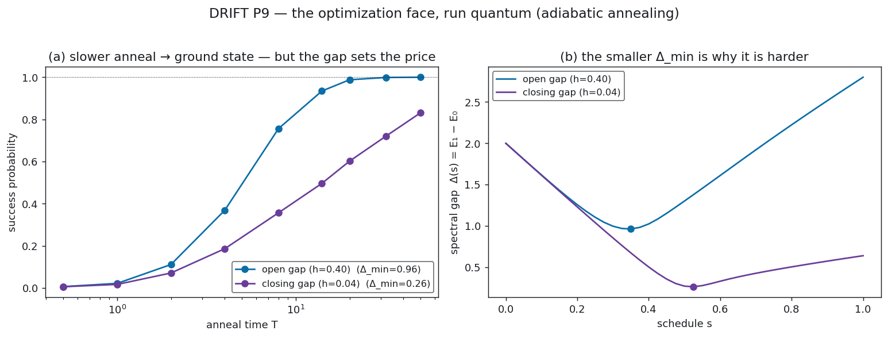
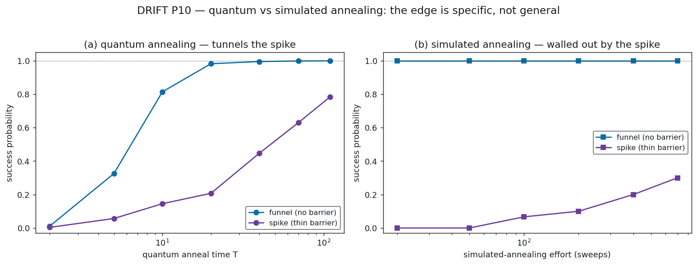
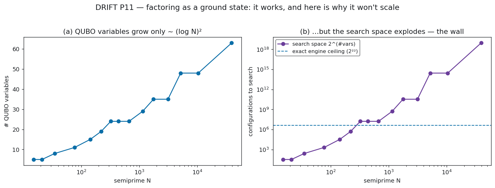
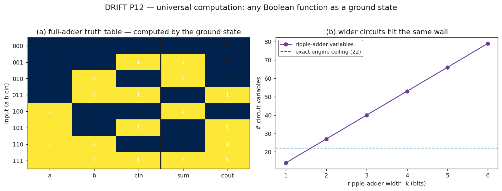

# DRIFT

> *A microscope for physical computation.*

DRIFT is a sandbox for **understanding how matter computes by minimizing energy**. It is
not built to prove a thesis or beat a benchmark — it is built to let you *see and measure*
one deep idea: that optimization, self-assembly, self-replication, and neural memory are
**the same mathematical object** — ground states of an Ising model — read with tensor
networks.

The name: a system *drifts* toward its energy minimum. The word is honest across all three
domains this project lives in — **physics** (drift to equilibrium / the ground state),
**neuroscience** (the drift-diffusion model of decision-making), and **replication**
(genetic drift).

## The thesis (one object, four faces)

A system of spins relaxing to its lowest-energy state **is a physical computer** solving an
optimization problem. Change only *what the Hamiltonian encodes*, and the same engine
becomes four different things:

| Face | The Hamiltonian encodes… | The ground state **is**… | The science |
|------|--------------------------|--------------------------|-------------|
| **Optimization** | an arbitrary QUBO/Ising problem | the optimal solution | combinatorial optimization, quantum annealing |
| **Self-assembly** | tile affinity rules (aTAM) | the assembled structure | molecular nanotech, DNA origami (Winfree) |
| **Self-replication** | couplings favoring periodicity | the replicated pattern | crystallization, von Neumann replicators |
| **Neural memory** | stored patterns (Hebbian) | a recalled memory (attractor) | Hopfield networks (Nobel Physics 2024) |

The brain, the crystal, the nanobot, the optimizer: **all compute by minimizing energy.**
DRIFT makes that visible and measurable under one roof.

## What DRIFT measures (the instrumentation)

Because the goal is *understanding*, the engine is built around observability. For every
face, the same probes:

- **How much it computes** → the **bond dimension χ** a tensor network needs to represent
  the state. χ is entanglement is information density — our thermometer for "how much
  computation lives in this matter" (the lesson learned in [Blaze](../Blaze)).
- **How it processes** → the **relaxation trajectory**: the path the system takes down the
  energy landscape.
- **What emerges** → the **ground state**: solution / structure / pattern / memory.
- **The physical floor** → the **Landauer cost** of the computation, and where real hardware
  sits relative to the ultimate limits (Margolus-Levitin, Lloyd).

## Honesty contract

The mathematics here — Ising ↔ QUBO ↔ Hopfield ↔ tensor networks ↔ optimization — is
**solid and established**. What is speculative is the leap to *"this is consciousness /
real grey goo / imminent nanobots."* DRIFT lives in the solid part and lets you *touch and
measure* the concepts that science fiction exaggerates, **without swallowing the
exaggeration**. Every claim in `docs/` is tagged as established science or as speculation.
See [`docs/CONCEPTS.md`](docs/CONCEPTS.md).

## Structure

```
DRIFT/
├── README.md
├── docs/
│   ├── ADR-0001-architecture.md   architecture decision (engine + builders, Python-first)
│   ├── ROADMAP.md                 phases, each with an "understanding goal" + deliverable
│   ├── CONCEPTS.md                rigorous glossary, science vs. speculation tagged
│   └── results/                   PHASE{N}-results.md + figures (filled as phases land)
├── drift/                         Python core (engine, solvers, builders, metrics, viz)
├── experiments/                   one script per phase
└── figures/
```

## Status

**Phases P0–P13 landed.** The engine, the four ground-state faces, the synthesis,
the *dynamical* face, the optimization face run *quantum*, the honest quantum-vs-classical
comparison, arithmetic as a ground state, universal computation, and — at last — the
tensor-network solver that reads a ground state the way the thesis always promised:

- P0 — scaffolding · P1 — engine + observability · P2 — optimization (MaxCut) ·
  P3 — quantum ground state + χ thermometer · P4 — Hopfield memory · P5 — Wang-tile
  self-assembly · P6 — crystallization (self-replication) · P7 — the microscope.
- **P8 — the dynamical (reservoir) face** (`drift/reservoir.py`): the Ising
  substrate driven in time as a physical reservoir, with *measurable* compute
  capacity — Jaeger **memory capacity** and a **separation** metric (MC = 43.5 / N=200,
  peaking at spectral radius ρ ≈ 1.0, the edge of chaos — see
  `figures/phase8_reservoir.png`). It can be built from a real `drift.ising.IsingModel`,
  and its spectral radius is set via the **Spectra** spine, so DRIFT is a Spectra
  consumer. Ships with DRIFT's first automated test suite (`tests/test_reservoir.py`, 5/5).
- **P9 — the optimization face, run quantum** (`drift/anneal.py`): the *same* Ising
  ground state Phase 2 reached by thermal annealing, now reached by **adiabatic quantum
  annealing** — evolve the uniform superposition |+…+⟩ under `H(s) = (1−s)(−ΣXᵢ) + s·H_problem`.
  Slow anneal → ground state (success ≈ 1.00); sudden quench fails (success < 0.01). The
  honest limit, measured: shrinking the gap (`Δ_min` 0.96 → 0.27) drops success (0.99 → 0.60
  at fixed T) — **quantum annealing pays the spectral gap; when it closes, QA fails too. No
  magic** (`tests/test_anneal.py`, 5/5; `figures/phase9_quantum_anneal.png`).
- **P10 — quantum vs simulated annealing, honestly** (`drift/tunneling.py`): both annealers on
  the *same* landscape. On a thin Hamming-weight **spike**, single-spin-flip SA is **walled out
  (success 0.17)** while quantum annealing **tunnels it (0.45 at T=40, a ~2.6× edge)** — but on
  a plain funnel both win (≈1.0), and a taller spike costs QA too. **The quantum edge is
  specific (a thin tunnelable barrier), not general** (`tests/test_tunneling.py`, 4/4;
  `figures/phase10_tunneling.png`).
- **P11 — factoring as a ground state** (`drift/factoring.py`): the boldest "matter computes"
  demo — encode `p·q = N` as a QUBO whose **ground state reveals the factors** (the energy
  minimum *is* the arithmetic). DRIFT's own Ising engine factors `15, 35, 143, … 221 = 13×17`,
  energy exactly 0 at each. **Honestly bounded:** the construction *raises* past the exact
  engine's reach — the variable count and shrinking gap are why factoring stays hard and RSA is
  safe. A principle, measured, **not an attack** (`tests/test_factoring.py`, 5/5;
  `figures/phase11_factoring.png`).
- **P12 — universal computation** (`drift/circuits.py`): logic gates synthesised as QUBO
  penalties and **composed by sharing wires**, so any Boolean circuit is a ground state. DRIFT's
  engine computes a **1-bit full adder**'s entire truth table (all 8 inputs → correct sum/cout,
  penalty 0); XOR built by composition; forcing a wrong output costs energy. AND/OR/NOT are
  complete → genuine universality, bounded by the same honest wall (`tests/test_circuits.py`,
  5/5; `figures/phase12_universal.png`).
- **P13 — the tensor-network ground state** (`drift/mps.py`): the microscope's lens becomes the
  engine. An **MPS solver** finds the ground state by imaginary-time TEBD, so the bond dimension
  χ that was Phase 3's *thermometer* is now the solver's own *compute budget* — the truncation
  **is** the physics. Matches exact Lanczos to **5.8e-5**, is a variational upper bound,
  **reproduces Phase 3's χ peak independently** (Γ≈0.77, χ=6), and runs **past the exact wall**:
  n=48 (2⁴⁸≈2.8×10¹⁴ states) with E/n → −4/π. The "read with tensor networks" thesis, finally
  delivered (`tests/test_mps.py`, 7/7; `figures/phase13_tensor.png`).
- **P14 — the GPU Ising engine** (`cuda/ising_pt.cu`, `drift/gpu.py`) — *CPU reference landed, GPU
  benchmark pending on-device.* Scales the **optimization face** past the ~22-spin exact wall by
  **parallel tempering** (replica-exchange Metropolis) on the GPU. The CPU reference
  (`drift/solvers/parallel_tempering.py`) finds the **exact** ground energy on MaxCut, a ±J spin
  glass, and a ferromagnet (`tests/test_parallel_tempering.py`, 5/5); the CUDA engine mirrors it
  (one block per replica, `nvcc -arch=sm_120`) and is validated by reproducing those exact energies
  on the first on-device run before any throughput is claimed (`docs/ADR-0004`).

The two synthesis figures sit in `figures/phase7_four_faces.png` (one engine, four faces)
and `figures/phase7_roofline.png` (real systems vs. the Landauer floor). See
[`docs/ROADMAP.md`](docs/ROADMAP.md) and `docs/results/PHASE{1..13}-results.md`.

## Results (the figures)

**One engine, four faces** — optimization, self-assembly, self-replication and neural memory,
all read as ground states of one Ising Hamiltonian:



**Real systems vs. the Landauer floor** — where actual hardware sits relative to the ultimate
thermodynamic limits of computation:



**The dynamical (reservoir) face** — the Ising substrate as a physical reservoir; measurable
compute capacity (memory capacity MC = 43.5 at N=200) peaking at the **edge of chaos** (ρ ≈ 1.0):



**The optimization face, run quantum** — adiabatic quantum annealing reaches the same Ising
ground state; a slower anneal succeeds, but the **spectral gap** sets the price (and when it
closes, quantum annealing fails too):



**Quantum vs simulated annealing** — on a thin barrier (the spike) quantum annealing tunnels
where single-spin-flip SA is walled out; on a plain funnel neither has an edge. The quantum
advantage is specific, not general:



**Factoring as a ground state** — DRIFT factors small semiprimes by relaxing a spin system to
its energy minimum; the variable count grows slowly but the search space explodes, which is
exactly why it stays a demonstration and not an attack:



**Universal computation** — logic gates composed into a 1-bit full adder; DRIFT's ground-state
engine computes its whole truth table. Any Boolean function is a ground state, bounded by the
same wall:



Per-phase write-ups (P1–P12) live in [`docs/results/`](docs/results/).

## Stack

Python-first (NumPy/SciPy + matplotlib for the engine and visuals — fast to iterate and
*see*), with a Rust port of the hot-path solver planned once systems grow past what exact
methods handle. Same Python-spec → Rust-core pattern as Blaze.
