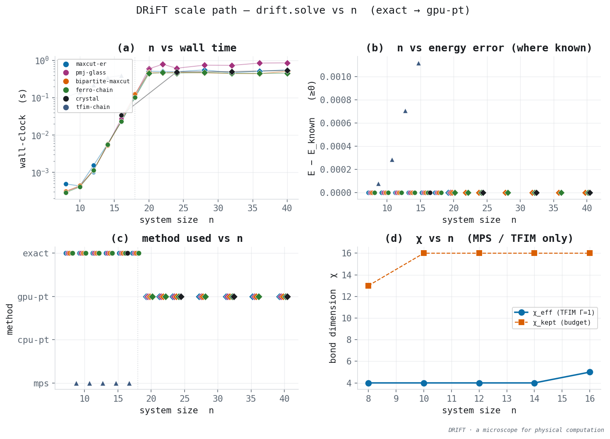

# Scale path — wall time, quality, and χ vs n via `drift.solve`

**Question (falsifiable):** How do wall-clock time and solution quality (and χ where an
MPS/tensor path applies) scale with system size n for fixed instance families, when
solving via `drift.solve` (exact → GPU-PT → CPU-PT)?

**Status:** GPU-PT recorded (34 rows); gpu_available=True.

**gpu-pt rows in this file: 34.**



## What was measured

A **versioned instance bank** (`drift/benchmarks/instances/manifest.json`, bank `v1`)
with stable IDs such as `v1.maxcut-er.n008.s001`. Generators are seeded; n≤8 classical
instances are also checked in as JSON fixtures so a generator change is loud. Families:

| Family | What it is | Known energy |
|--------|------------|--------------|
| `maxcut-er` | Erdős–Rényi MaxCut G(n, 1/2) | exact enum, n≤20 |
| `pmj-glass` | complete ±J spin glass, h=0 | exact enum, n≤20 |
| `bipartite-maxcut` | random bipartite MaxCut | analytic: E = −n_edges |
| `ferro-chain` | open 1-D ferromagnet | analytic: E = −(n−1) |
| `crystal` | period-4 stripe crystal (4×4 / 6×4 / 4×8 / 10×4) | analytic: E = −2n |
| `tfim-chain` | open TFIM at Γ/J = 1 | Lanczos, n≤14; χ via MPS |

Classical families go through **`drift.solve`**. χ is recorded **only** on `tfim-chain`
through the existing MPS/TEBD solver (`drift.mps`). That path is 1-D nearest-neighbour
TFIM: it does **not** apply to dense MaxCut, spin glasses, or 2-D crystals.

**MPS cutoff (documented):** default sweep χ ladder is **n≤16**
(`MPS_N_MAX_SWEEP`). n=20 and n=24 sit in the bank for local runs (`--mps-n-max 24`).
Phase 13 has shown n=48 with a larger budget; that is out of scope for this CPU curve.

A heuristic minimum is **never** marked `certified`. GPU is optional: if the CUDA
binary is missing, n > `exact_max` (18) continues on CPU-PT.

This file has **102 rows** (61 exact, 0 cpu-pt, 34 gpu-pt, 5 mps, 2 skipped); **61 certified**. 63 primary-seed rows, 39 extra-seed rows. Methods present: `exact, gpu-pt, mps, skipped`.

## How to regenerate

```bash
# After catalog_rows() changes (fingerprints + known energies + n≤8 fixtures):
python -m drift.benchmarks

# CI smoke (does not overwrite docs/results/scale_sweep.*):
python -m experiments.scale_sweep --ci

# Published CPU ladder (this document's default):
python -m experiments.scale_sweep --profile local --write-report

# Same IDs on a machine with cuda/ising_pt (Windows/sm_120). Records gpu-pt only
# if the binary actually ran — never by renaming cpu-pt rows:
python -m experiments.scale_sweep --profile gpu --write-report
```

Results: `docs/results/scale_sweep.csv`, `docs/results/scale_sweep.json`,
`figures/scale/scale_sweep.png`. JSON `hardware` and `gpu_pt_rows` pin provenance.

This file was produced at `2026-09-21T00:21:45Z` with `python -m experiments.scale_sweep --profile gpu --write-report`
(profile=gpu, n≤40, exact_max=18,
n_rounds=400, python 3.11.3, Windows-10-10.0.19045-SP0).

## Curves

Hardware: GPU-PT recorded (34 rows); gpu_available=True. `exact_max=18`. CPU-PT uses `drift.solve` defaults
(32 replicas, 400 rounds unless `--n-rounds` / `--ci` override, 4 sweeps/round).
MPS uses χ_max=16, 12 sweeps, a short imaginary-time schedule (a scale probe, not
a high-precision Phase-13 rerun).

### (a) Wall time vs n

Primary seed per family (lines in the figure). Extra seeds are plotted as faint
markers at the same n; they are not in this table.

Exact enumeration grows exponentially, as it must (2ⁿ configurations):

| n | maxcut-er | pmj-glass | bipartite | ferro-chain |
|--:|----------:|----------:|----------:|----------:|
| 8 | 489.60 µs | 313.00 µs | 309.90 µs | 288.60 µs |
| 10 | 433.80 µs | 421.40 µs | 440.80 µs | 408.60 µs |
| 12 | 1.56 ms | 1.16 ms | 1.14 ms | 1.14 ms |
| 14 | 5.69 ms | 5.33 ms | 5.36 ms | 5.55 ms |
| 16 | 22.78 ms | 27.25 ms | 23.23 ms | 23.41 ms |
| 18 | 105.67 ms | 118.81 ms | 127.23 ms | 102.80 ms |

At n>18 the dispatcher switches to **gpu-pt** (GPU binary present).

| n | method | maxcut-er | pmj-glass | bipartite | ferro-chain |
|--:|--------|----------:|----------:|----------:|----------:|
| 20 | gpu-pt | 513.25 ms | 597.80 ms | 471.62 ms | 446.76 ms |
| 22 | gpu-pt | 504.35 ms | 787.61 ms | 461.36 ms | 472.44 ms |
| 24 | gpu-pt | 499.55 ms | 618.09 ms | 481.12 ms | 457.06 ms |
| 28 | gpu-pt | 556.09 ms | 744.44 ms | 462.41 ms | 476.83 ms |
| 32 | gpu-pt | 468.25 ms | 737.52 ms | 448.06 ms | 448.58 ms |
| 36 | gpu-pt | 516.40 ms | 847.78 ms | 442.95 ms | 448.08 ms |
| 40 | gpu-pt | 557.94 ms | 860.95 ms | 510.32 ms | 455.29 ms |

Crystal size steps (analytic E = −2n):

| id | n | method | certified | E | dE | wall |
|----|--:|--------|-----------:|--:|----|------|
| `v1.crystal.n016.s000` | 16 | exact | True | -32.0 | 0 | 34.20 ms |
| `v1.crystal.n024.s000` | 24 | gpu-pt | False | -48.0 | 0 | 492.85 ms |
| `v1.crystal.n032.s000` | 32 | gpu-pt | False | -64.0 | 0 | 501.95 ms |
| `v1.crystal.n040.s000` | 40 | gpu-pt | False | -80.0 | 0 | 537.42 ms |

### (b) Energy error vs known optimum

Rows with an oracle: **87**. Classical rows with dE = 0: **83**. Classical rows with dE ≠ 0: **0**.

Wherever an oracle exists on this ladder, **error is 0** for exact and PT rows (certified only when method=`exact`).

ER MaxCut and ±J glass have **no oracle** on 12 rows (n past enumeration). Those rows report energy and time only — strong minima, not certified.

MPS (not a `drift.solve` path) is variational:

| n | χ_eff | χ_kept | dE vs Lanczos | wall |
|--:|------:|-------:|---------------|------|
| 8 | 4 | 13 | 7.91e-05 | 102.70 ms |
| 10 | 4 | 16 | 0.000287 | 143.38 ms |
| 12 | 4 | 16 | 0.000706 | 218.16 ms |
| 14 | 4 | 16 | 0.00112 | 350.47 ms |

Never certified.

### Extra seeds (39 rows)

Stochastic families (`maxcut-er`, `pmj-glass`, `bipartite-maxcut`) carry extra seeds at cheap n (exact-reachable, plus one seed at the n=20 dispatcher wall). `ferro-chain` is seed-invariant and is **not** duplicated.

Extra-seed rows with an oracle: 39; dE = 0 on 39 of those.

### (c) Method vs n

The dispatcher does what it says:

- n ≤ 18 → `exact`, `certified=True` (61 rows)
- n > 18, GPU binary present → `gpu-pt`, `certified=False` (34 rows)
- n > 18, no GPU / `--no-gpu` → `cpu-pt`, `certified=False` (0 rows)
- `tfim-chain` → `mps`, `certified=False` (5 rows); skipped above the χ cutoff (2 rows)

No row has `certified=True` with a heuristic method. An empty `gpu-pt` band is a
missing binary (or `--profile local`), not a silent fallback pretending to be GPU.

### (d) χ vs n (TFIM / MPS only)

Open TFIM at Γ/J = 1, χ_max=16, n≤16:

| n | χ_eff | χ_kept | wall |
|--:|------:|-------:|------|
| 8 | 4 | 13 | 102.70 ms |
| 10 | 4 | 16 | 143.38 ms |
| 12 | 4 | 16 | 218.16 ms |
| 14 | 4 | 16 | 350.47 ms |
| 16 | 5 | 16 | 392.32 ms |

Effective χ stays small on this short schedule (a scale-path probe). Treat χ here as that probe, not a replacement for `docs/results/PHASE13-results.md`.

Skipped at the documented cutoff: `v1.tfim-chain.n020.s000`, `v1.tfim-chain.n024.s000`. Raise `--mps-n-max` locally; Phase 13 already measured n=48.

## Answer to the question

On these fixed families, **`drift.solve` has two time regimes**. Below n=18
the certified exact engine's wall time tracks 2ⁿ. Above that, GPU-PT grows with the PT loop (replicas × rounds × sweeps × work per sweep), not with 2ⁿ. **Solution quality matches every available oracle** on this run for exact and PT rows; PT rows stay `certified=False`. χ is a tensor-network number: it is defined on
the TFIM chain and is not claimed for MaxCut or spin glasses. GPU-PT is the same
experiment with a binary; it is not inferred from the CPU curve.

## Honesty

- Heuristic (cpu-pt / gpu-pt / mps) is never `certified`.
- ER MaxCut and ±J glass at n>20 have no known energy here.
- A CPU PT curve is not a GPU throughput claim (see Phase 14 for Gflips/s).
- This file records only methods that ran. Zero `gpu-pt` rows means the CUDA
  engine did not run, not that GPU time equals CPU time.
- The MPS ladder uses a reduced schedule so the sweep stays cheap; treat χ as a
  scale-path probe, not a replacement for `docs/results/PHASE13-results.md`.
- Extra ferro-chain seeds are omitted on purpose: that generator ignores `seed`.
